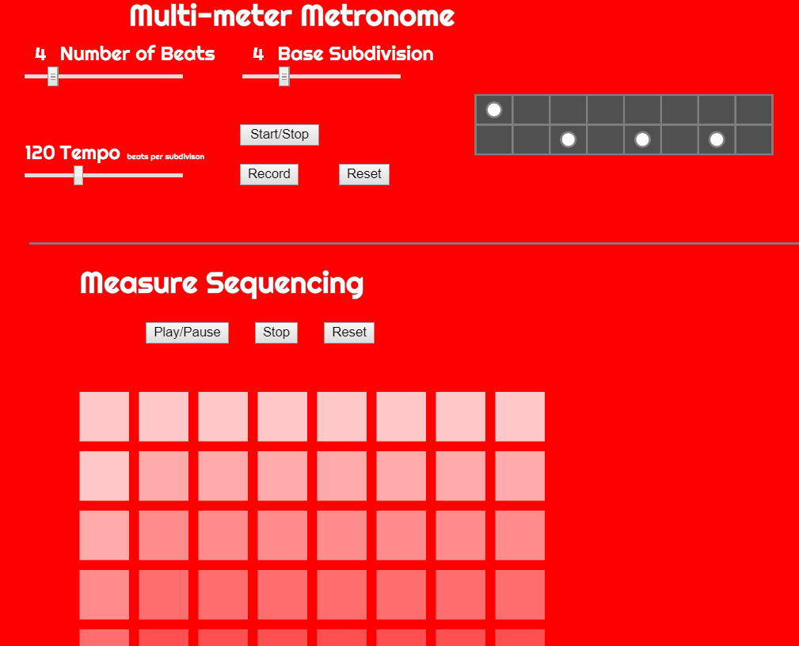

# metronome
p5.js Metronome

# Key Features

- Capable of meters with number of beats from 1 to 20

- Capable of relatively intrepreting half through 32nd notes

- Two-track visualisation - accented notes and unaccented notes

- Sequence measures of varying beats and subdivisions

- Dynamic tempo control during playback

